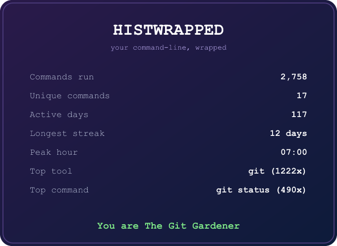

# histwrapped

A command-line tool that reads your shell history and reports stats about it:
your most-used commands, when you run them, your longest active streak, and a
summary card you can save as an image.

<p align="center">
  
</p>

## Install

```sh
git clone https://github.com/swemendez/histwrapped
cd histwrapped
cargo install --path .
```

A crates.io release is not published yet.

## Usage

```sh
histwrapped stats                    # text summary
histwrapped tui                      # interactive dashboard (q to quit)
histwrapped wrapped                  # print the summary card
histwrapped wrapped --png card.png   # save the card as PNG
histwrapped wrapped --svg card.svg   # save the card as SVG
histwrapped export                   # print stats as JSON
```

These options work on any subcommand:

```sh
histwrapped --top 20 stats                  # longer top-N lists
histwrapped --file ~/.zsh_history stats     # use a specific file
histwrapped --shell bash stats              # force a parser
```

## Stats reported

- Top programs, top subcommands (such as `git status`), and top full commands
- Total and unique command counts
- Active days, longest streak, and busiest hour (requires timestamps)
- A terminal personality label based on your most-used program

## Supported shells

| Shell | Notes                                          |
|-------|------------------------------------------------|
| zsh   | extended and plain history, multi-line commands |
| bash  | with and without `HISTTIMEFORMAT` timestamps    |
| fish  | `fish_history` format                          |

zsh only records timestamps when extended history is enabled. Add
`setopt EXTENDED_HISTORY` to your `~/.zshrc` to get the streak and
time-of-day stats.

## License

MIT. See [LICENSE](LICENSE).
